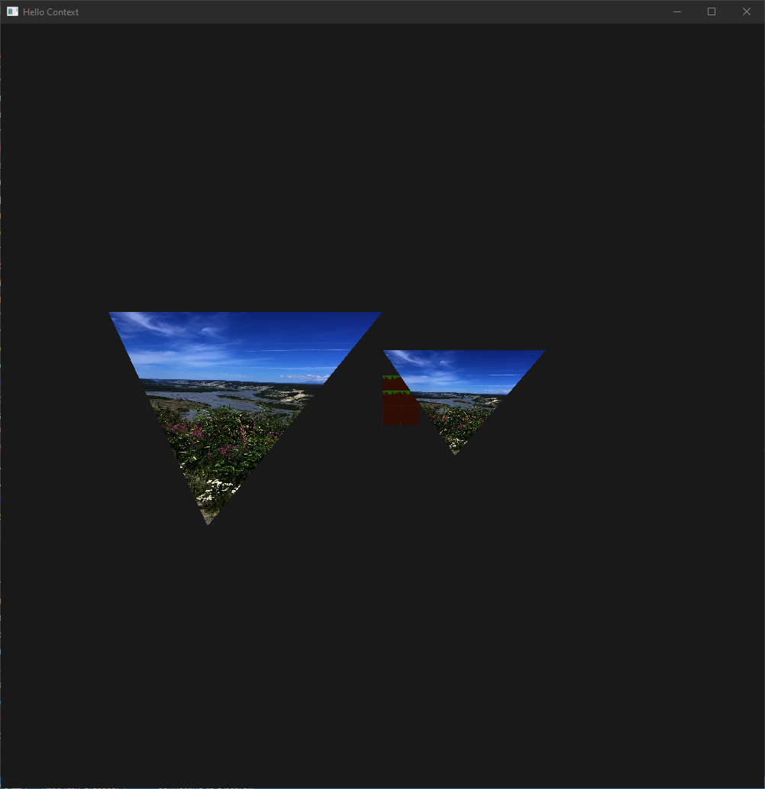

# Sukakpak
This is a practice repo where I am developing a vulkan graphics engine.
# Supported Features
Currently the project supports drawing multiple meshes, updating uniforms, a depth bufer and texture mapping.

